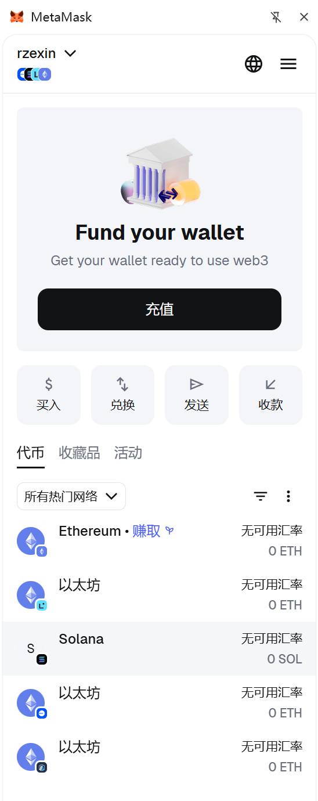
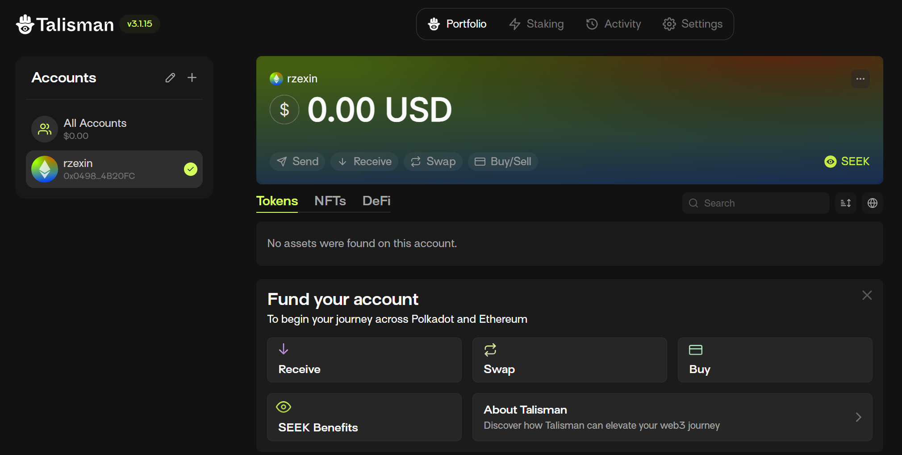
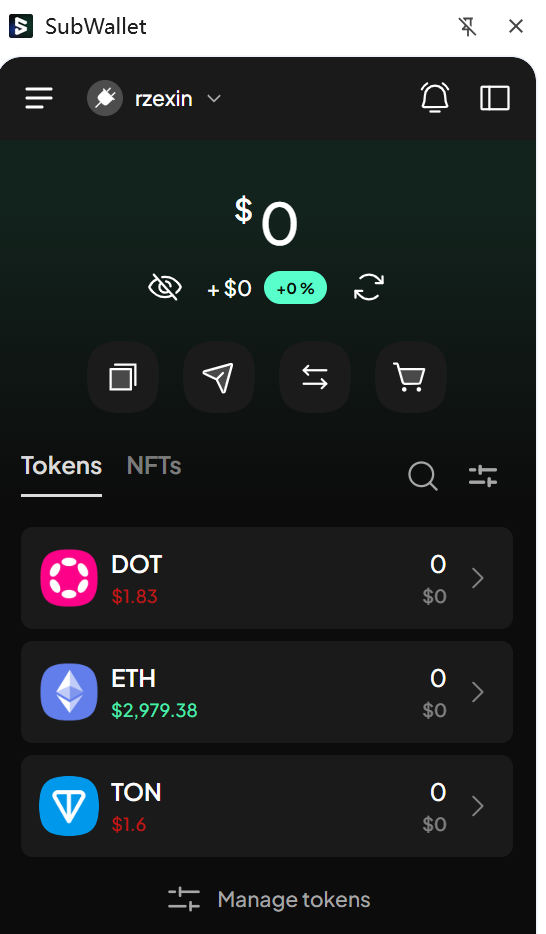
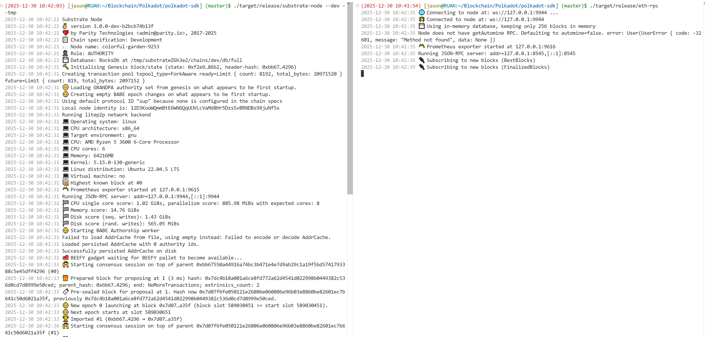
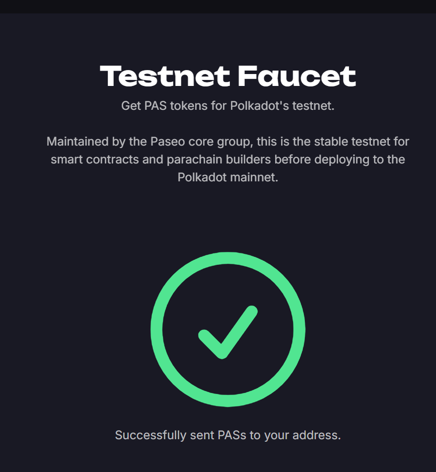
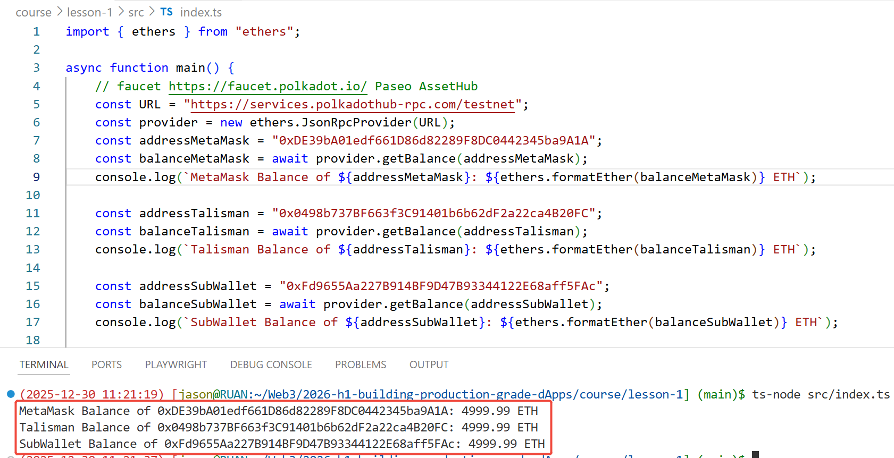

# Homework: Lesson 1

## 1 安装三种不同的钱包，创建测试账户。

## （1）MetaMask

> 0xDE39bA01edf661D86d82289F8DC0442345ba9A1A

## （2）Talisman

> 0x0498b737BF663f3C91401b6b62dF2a22ca4B20FC

## （3）SubWallet

> 0xFd9655Aa227B914BF9D47B93344122E68aff5FAc

## 2 本地编译Polkadot SDK，启动节点和RPC服务

## 3 https://faucet.polkadot.io/?parachain=1111 得到测试token

## 4 分别在钱包中和运行程序 [https://github.com/papermoonio/2026-h1-building-production-grade-dApps/blob/main/course/lesson-1/src/index.ts](https://github.com/papermoonio/2026-h1-building-production-grade-dApps/blob/main/course/lesson-1/src/index.ts) 确认token领取成功

结果截图通过PR提交到  https://github.com/papermoonio/2026-h1-building-production-grade-dApps/tree/main/homework/lesson-1

